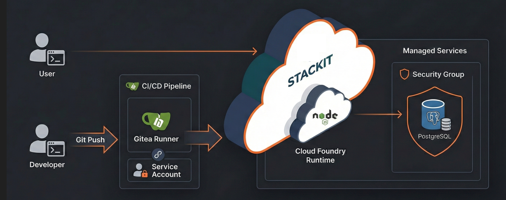

# STACKIT Cloud Resume Challenge

<div align="center">
  
  <br/>
  <br/>

  <h3> <a href="https://mein-counter-app-hello-world.apps.01.cf.eu01.stackit.cloud/Kontakt/">Mein CV</a></h3>
  <hr />
</div>

## Die Idee hinter dem Projekt

Die **Cloud Resume Challenge** ist ein Community-Projekt, um theoretisches Cloud-Wissen in der Praxis anzuwenden. Ziel war es, einen digitalen Lebenslauf auf der **STACKIT Cloud** zu hosten und dabei den gesamten Stack – von der Infrastruktur über die Datenbank bis zur CI/CD-Pipeline – selbst aufzubauen. Es demonstriert das Zusammenspiel von Frontend-Entwicklung, Backend-Logik (Node.js), Netzwerksicherheit und moderner Automatisierung.

---

### Haupt-Feature: Persistenter Besucherzähler
Die Applikation zeigt nicht nur statischen Text, sondern interagiert mit einer Datenbank:
* **Echtzeit-Counter**: Bei jedem Seitenaufruf wird über das Node.js-Backend ein Zähler in der PostgreSQL-Datenbank erhöht.
* **Daten-Sicherheit**: Dank der managed DB-Instanz auf STACKIT bleibt der Zählerstand über Deployments hinweg bestehen.

---

## Infrastruktur-Evolution (Roadmap)
Das Projekt wurde in drei Phasen entwickelt:
* **Phase 1: Object Storage**: Initiales Hosting als statische Seite.
* **Phase 2: PaaS Migration**: Umstieg auf Cloud Foundry für serverseitige Logik.
* **Phase 3: Datenbank & Automatisierung**: Anbindung von PostgreSQL und CI/CD via Service Account (SSSA).

---

## System-Architektur

Dieses Diagramm visualisiert den Datenfluss und den automatisierten Deployment-Prozess:

<div align="center">
  
</div>

---

## Setup & Installation

### Installation der CLI-Werkzeuge
Für die Verwaltung der Cloud-Ressourcen sind die Cloud Foundry CLI (v8) und die STACKIT CLI erforderlich.

```bash
# CF CLI (v8) installieren
wget -q -O - [https://packages.cloudfoundry.org/debian/cli.cloudfoundry.org.key](https://packages.cloudfoundry.org/debian/cli.cloudfoundry.org.key) | sudo gpg --dearmor -o /usr/share/keyrings/cli.cloudfoundry.org.gpg
echo "deb [signed-by=/usr/share/keyrings/cli.cloudfoundry.org.gpg] [https://packages.cloudfoundry.org/debian](https://packages.cloudfoundry.org/debian) stable main" | sudo tee /etc/apt/sources.list.d/cloudfoundry-cli.list
sudo apt-get update && sudo apt-get install cf8-cli
```
```bash
# STACKIT CLI installieren
curl -fL [https://github.com/stackitcloud/stackit-cli/releases/latest/download/stackit-linux-amd64](https://github.com/stackitcloud/stackit-cli/releases/latest/download/stackit-linux-amd64) -o stackit
chmod +x stackit && sudo mv stackit /usr/local/bin/
```
Docs: https://github.com/stackitcloud/stackit-cli#installation
### Infrastruktur vorbereiten

Service Account (SSSA) für CI/CD einrichten
```bash
cf create-service space-scoped-service-account space-deployer cvuser
cf create-service-key cvuser key_cvuser
cf service-key cvuser key_cvuser 
```
Nach dem Login (cf login) müssen die Dienste und Sicherheitsregeln konfiguriert werden.


Managed PostgreSQL & Security Groups:
Um die Datenbank abzusichern, wurde der Zugriff strikt auf Port 5432 beschränkt.


### Erstellt die Datenbank-Instanz (Name muss mit manifest.yml übereinstimmen)
```bash
cf create-service postgresql <plan> cv-db2
```
Docs: https://docs.stackit.cloud/products/runtime/cloud-foundry/how-tos/create-cloud-foundry-service-accounts/
### CI/CD Workflow (deploy.yml)
Die Pipeline nutzt Gitea/GitHub Actions und automatisiert den gesamten Prozess bei jedem Code-Push in den main Branch.

Erforderliche Secrets
Folgende Variablen müssen als verschlüsselte Secrets im Repository hinterlegt sein:

STACKIT_SA_KEY: Der Inhalt der Service-Account-JSON-Datei für den RSA-Login.

CF_USER & CF_PASSWORD: Die generierten SSSA-Credentials.

CF_ORG & CF_SPACE: Die Ziel-Umgebung in der Cloud.

Deployment-Logik
Der Kernschritt in der Pipeline:
```yaml
- name: Cloud Foundry Login & Push
  run: |
    cf api [https://api.system.01.cf.eu01.stackit.cloud](https://api.system.01.cf.eu01.stackit.cloud)
    cf auth "${{ secrets.CF_USER }}" "${{ secrets.CF_PASSWORD }}"
    cf target -o "${{ secrets.CF_ORG }}" -s "${{ secrets.CF_SPACE }}"
    cf push -f ./cf-hello-world/manifest.yml -p ./cf-hello-world
```
Docs: https://docs.cloudfoundry.org/devguide/deploy-apps/manifest.html
### Projektstruktur
Die Ordnerstruktur ist so optimiert, dass die App-Logik im Unterverzeichnis gekapselt ist, was einen sauberen CI/CD-Push ermöglicht:
```text
.forgejo/workflows/
  └── deploy.yml          # CI/CD Pipeline Definition
cf-hello-world/           # Aktiver Applikations-Ordner
  ├── public/             # Frontend Assets
  │   ├── Kontakt/        # Unterseite Lebenslauf
  │   │   ├── index.html
  │   │   └── style.css
  │   └── index.html      # Startseite mit Besucher-Counter
  ├── manifest.yml        # Cloud Foundry Konfiguration
  ├── package.json        # Node.js Dependencies
  └── server.js           # Backend & PostgreSQL-Logik
db-security-group.json    # Firewall-Dokumentation
README.md                 # Diese Dokumentation
architecture.png          # Bild für Architektur
```
### Ausblick
Der nächste Meilenstein ist die Umstellung auf Infrastructure as Code (IaC) via Terraform. Dies umfasst die automatisierte Erstellung der Datenbank-Instanzen, Security Groups und Service Accounts, um eine 100% reproduzierbare Cloud-Umgebung zu schaffen.

Docs: https://registry.terraform.io/providers/stackitcloud/stackit/latest/docs
